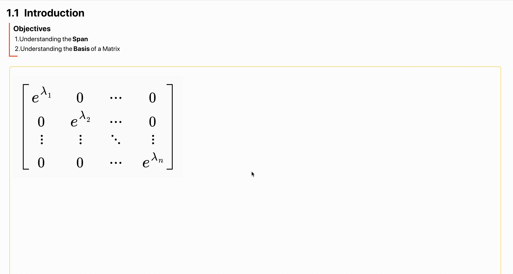

# latex_spring
latex parser and animation library for react!

# usage example:
In math_formula wirte the part of latex you want to animate in \anim<anim_id>{part of the formula you want to animate}
and add a Latex.Anim component as a child with the same anim_id you usesd in your formula (id={anim_id}).
Latex.Anim  is actually a svg group component and you can animate it with inline style ,using emotion, styled component or react-spring! 
If you preferet to use react-spring, you don't need to make a animated version of the component.It already gives you a <animated.g  style={spring}/> 

``` typescript 
import {css as emoCss} from '@emotion/core'
import Latex from 'latex-spring'

<Latex
    style={{
        fill: 'black',
        position: 'absolute',
        top: 30,
        left: 10,
        zIndex: 1,
    }}
    font_size={1.3}
    className={'mathbox__svg'}
    math_formula={String.raw`
    \begin{bmatrix}
    e^{\lambda_1} & 0& \cdots & 0 \\
    0 & \anim<test>{e^{\lambda_2}} & \cdots & 0 \\
    \vdots & \vdots & \ddots & \vdots \\ 
    0 & 0 & \cdots & e^{\lambda_n}
    \end{bmatrix} `}
>
    <Latex.Anim
        id="test"
        css={emoCss({
            transition: ' all .5s ease-in-out',
            '&:hover': {
                fill: 'red',
                scale: '1.2',
                cursor: 'pointer',
                transition: ' all .5s ease-in-out',
            },
        })}
    />
</Latex>

```

